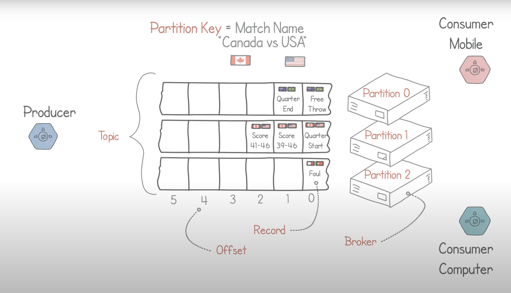
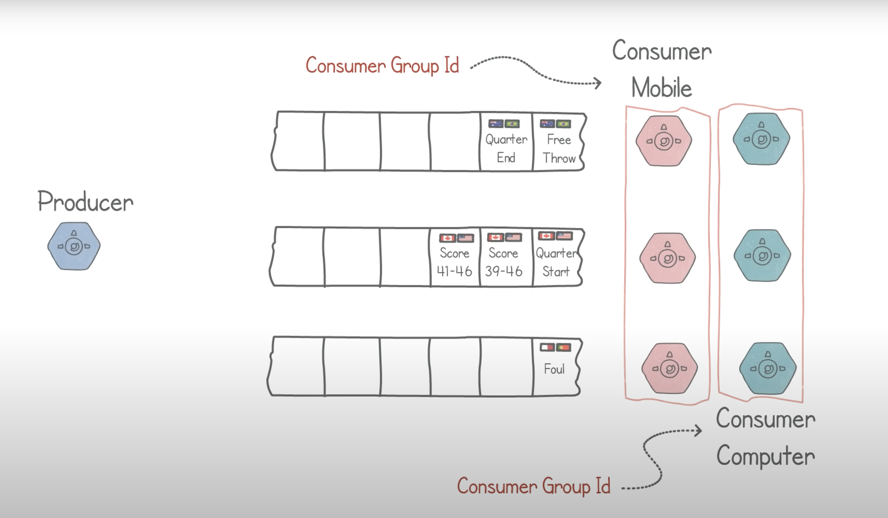
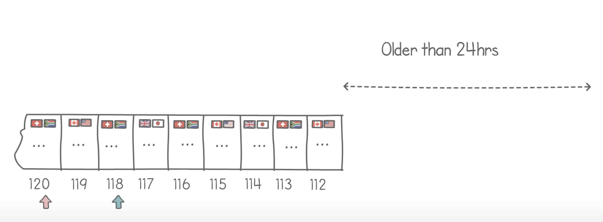
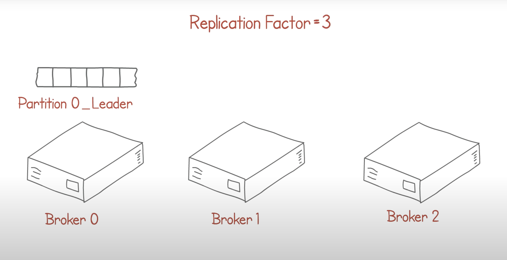

https://www.youtube.com/watch?v=Ch5VhJzaoaI

- partition key: match name
- broker holds one or more partition
- record: each item in partition
- offset: number to each record
- topic: group of partition handeling same type of data

- having one consumer for each partition
- consumer group id

